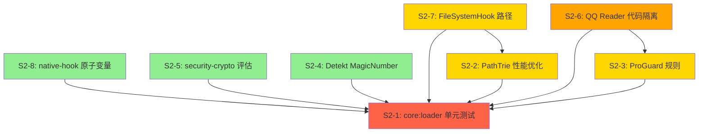

# MultiApp S2 代码审查问题修复方案

## 总体优先级排序

基于影响范围、修复复杂度和依赖关系，建议处理顺序：

1. **S2-8** (native-hook.cpp 全局状态管理) → 最简单，无依赖
2. **S2-5** (security-crypto alpha 版本) → 评估即可，无代码变更
3. **S2-4** (Detekt MagicNumber 规则) → 配置变更，低风险
4. **S2-3** (ProGuard 规则过于宽泛) → 配置变更，中等风险
5. **S2-7** (FileSystemHook 路径替换不完整) → 小范围代码变更
6. **S2-2** (PathTrie 线性扫描性能) → 中等复杂度算法优化
7. **S2-6** (QQ Reader 特定代码隔离) → 架构重构，需谨慎
8. **S2-1** (core:loader 单元测试) → 工作量最大，可并行推进

---

## S2-1: core:loader 模块无测试覆盖

### 现状分析
- 121 个源文件，88 个测试文件（均为集成测试）
- 缺少单元测试，无法快速验证各个组件的独立逻辑
- 测试文件位于 `src/androidTest/` 和 `src/test/`，但 `src/test/` 中主要是 app 模块的测试

### 修复方案

**策略**: 为关键类添加纯 JVM 单元测试（使用 JUnit5 + MockK + Robolectric）

**优先测试的类**（按重要性排序）：
1. `RuntimeBootstrapOrchestrator` - 核心启动编排逻辑
2. `VirtualPackageRegistry` - 包注册管理
3. `VirtualActivityManager` - Activity 管理核心
4. `NativeLibHandler` - 原生库加载
5. `StealthClassLoader` - 类加载器
6. `VirtualProviderManager` - Provider 管理
7. `VirtualServiceManager` - Service 管理
8. `IntentRemappingInstrumentation` - Intent 重映射
9. `FileBackedSharedPreferences` - 文件存储
10. `QqReaderProfile` - App 兼容配置

**测试结构**:
```
core/loader/src/test/java/com/multiapp/core/loader/
├── VirtualPackageRegistryTest.kt
├── VirtualActivityManagerTest.kt
├── NativeLibHandlerTest.kt
├── StealthClassLoaderTest.kt
├── VirtualProviderManagerTest.kt
├── VirtualServiceManagerTest.kt
├── RuntimeBootstrapOrchestratorTest.kt
├── IntentRemappingInstrumentationTest.kt
├── FileBackedSharedPreferencesTest.kt
└── QqReaderProfileTest.kt (已有)
```

**测试策略**:
- 使用 MockK 模拟 Android framework 依赖
- 使用 Robolectric 处理 Context、PackageManager 等 Android 类
- 测试边界条件、异常处理、并发安全
- 目标覆盖率: 核心类 > 70%

### 风险评估
- **低风险**: 纯测试代码，不影响生产逻辑
- **潜在问题**: 部分类可能需要重构以提高可测试性（如减少 static 依赖）
- **工作量**: 高（预计 3-5 天）

### 依赖关系
- 无上游依赖
- 可与其他 S2 问题并行处理

---

## S2-2: PathTrie 线性扫描性能

### 现状分析
**文件**: `core/hook/src/main/java/com/multiapp/core/hook/NativeHookBridge.kt` (第779-795行)

```kotlin
private fun translateScopedPath(originalPath: String): String? {
    val processSlot = activeProcessSlot
    val instanceId = activeInstanceId
    if (processSlot.isBlank() || instanceId.isBlank()) return null

    var bestRule: PathRedirectionRule? = null
    for (rule in pathRedirections.values) {
        if (!rule.scoped || !rule.matchesScope(processSlot, instanceId)) continue
        if (pathMatchesPrefix(originalPath, rule.fromPrefix) &&
            rule.fromPrefix.length > (bestRule?.fromPrefix?.length ?: -1)
        ) {
            bestRule = rule
        }
    }
    return bestRule?.let { secureScopedTranslation(it, originalPath) }
}
```

**问题**: O(n) 线性扫描所有重定向规则，当规则数量增加时性能下降。

### 修复方案

**方案 A: Trie（前缀树）数据结构**

```kotlin
class PathTrie {
    private val root = TrieNode()
    
    data class TrieNode(
        val children: MutableMap<Char, TrieNode> = mutableMapOf(),
        val rule: PathRedirectionRule? = null
    )
    
    fun insert(prefix: String, rule: PathRedirectionRule) {
        var node = root
        for (ch in prefix) {
            node = node.children.getOrPut(ch) { TrieNode() }
        }
        node.copy(rule = rule) // 最长前缀匹配
    }
    
    fun findLongestPrefix(path: String): PathRedirectionRule? {
        var node = root
        var bestRule: PathRedirectionRule? = null
        var lastMatchNode: TrieNode? = null
        
        for (ch in path) {
            node = node.children[ch] ?: break
            if (node.rule != null) {
                bestRule = node.rule
                lastMatchNode = node
            }
        }
        return bestRule
    }
}
```

**方案 B: 按 scope 分组 + 排序列表（推荐，更简单）**

```kotlin
// 在 NativeHookBridge 中维护分组索引
private val scopedRulesBySlot = ConcurrentHashMap<String, List<PathRedirectionRule>>()

fun buildScopedRuleIndex() {
    val grouped = pathRedirections.values
        .filter { it.scoped }
        .groupBy { it.processSlot }
        .mapValues { (_, rules) ->
            rules.sortedByDescending { it.fromPrefix.length } // 长前缀优先
        }
    scopedRulesBySlot.clear()
    scopedRulesBySlot.putAll(grouped)
}

private fun translateScopedPath(originalPath: String): String? {
    val processSlot = activeProcessSlot
    val instanceId = activeInstanceId
    if (processSlot.isBlank() || instanceId.isBlank()) return null
    
    val rules = scopedRulesBySlot[processSlot] ?: return null
    for (rule in rules) {
        if (rule.matchesScope(processSlot, instanceId) &&
            pathMatchesPrefix(originalPath, rule.fromPrefix)) {
            return secureScopedTranslation(rule, originalPath)
        }
    }
    return null
}
```

**推荐方案 B**，原因：
1. 实现简单，易于理解和维护
2. 规则数量有限（通常 < 100），排序列表足够高效
3. 避免引入 Trie 的复杂性
4. 性能从 O(n) 优化到 O(m)，其中 m 是该 scope 下的规则数（通常 < 10）

### 风险评估
- **中等风险**: 修改核心路径重定向逻辑
- **潜在问题**: 索引更新时机、内存占用
- **缓解措施**: 
  - 在规则加载完成后调用 `buildScopedRuleIndex()`
  - 添加单元测试验证路径匹配正确性
  - 保留原有逻辑作为 fallback

### 依赖关系
- 无上游依赖
- 建议在 S2-1（单元测试）之后或同时进行，确保有测试覆盖

---

## S2-3: ProGuard 规则过于宽泛

### 现状分析
**文件**: `app/proguard-rules.pro` (第10行)

```
-keep class com.multiapp.core.model.** { *; }
```

**问题**: 保留所有 model 类的所有成员，包括可能不需要序列化的内部类、辅助类。

### 修复方案

**步骤 1: 分析 model 模块的实际使用**

检查哪些类真正需要 keep：
- 被 Gson 序列化/反序列化的类
- 通过反射访问的类
- 跨进程传递的 Parcelable 类

**步骤 2: 精细化规则**

```proguard
# 替换原有宽泛规则
# -keep class com.multiapp.core.model.** { *; }

# 只保留需要序列化的数据类
-keep class com.multiapp.core.model.VirtualConstants { *; }
-keep class com.multiapp.core.model.VirtualAppInfo { *; }
-keep class com.multiapp.core.model.InstanceConfig { *; }
-keep class com.multiapp.core.model.DeviceIdentity { *; }
-keep class com.multiapp.core.model.HookConfig { *; }

# 保留所有使用 @SerializedName 注解的字段
-keepclassmembers class com.multiapp.core.model.** {
    @com.google.gson.annotations.SerializedName <fields>;
}

# 保留 Parcelable 相关
-keep class com.multiapp.core.model.** implements android.os.Parcelable {
    public static final ** CREATOR;
}

# 如果有内部类需要序列化
-keep class com.multiapp.core.model.**$* { *; }
```

**步骤 3: 验证**

1. 运行 `./gradlew :app:minifyReleaseWithR8` 构建 release 版本
2. 检查 R8 输出日志，确认没有误删必要类
3. 运行完整的集成测试套件
4. 在真机上测试核心功能（启动虚拟应用、文件访问、Hook 生效）

### 风险评估
- **中等风险**: 可能导致运行时 ClassNotFoundException
- **潜在问题**: 
  - 遗漏某个需要 keep 的类
  - 内部类、匿名类被混淆
- **缓解措施**: 
  - 先在开发环境充分测试
  - 使用 `-printusage usage.txt` 记录被移除的类
  - 分阶段收紧规则，每次只修改一部分

### 依赖关系
- 无上游依赖
- 建议在有完整测试覆盖后进行（S2-1）

---

## S2-4: Detekt MagicNumber 规则关闭

### 现状分析
**文件**: `config/detekt/detekt.yml` (第17-18行)

```yaml
style:
  MagicNumber:
    active: false
```

**问题**: 魔法数字未被检测，代码可读性差。

### 修复方案

**步骤 1: 启用规则并定义例外**

```yaml
style:
  MagicNumber:
    active: true
    # 允许的魔法数字（常见场景）
    ignoreNumbers:
      - '-1'
      - '0'
      - '1'
      - '2'
      - '10'
      - '100'
      - '1000'
      - '1024'
    # 允许在这些上下文中使用魔法数字
    ignoreAnnotated:
      - 'Preview'
      - 'Test'
      - 'androidx.compose.runtime.Composable'
    # 允许常量定义中的数字
    ignorePropertyDeclaration: true
    # 允许枚举中的数字
    ignoreEnums: true
    # 允许hashCode/equals中的数字
    ignoreHashCodeFunction: true
    # 允许范围表达式
    ignoreRanges: true
```

**步骤 2: 修复现有违规**

运行 detekt 检查：
```bash
./gradlew detekt
```

逐个修复高优先级违规：
1. 将魔法数字提取为命名常量
2. 使用枚举或 sealed class 替代状态码
3. 为剩余违规添加 `@Suppress("MagicNumber")` 注解（仅限合理场景）

**示例修复**:
```kotlin
// Before
if (statusCode == 200) { ... }
Thread.sleep(3000)

// After
companion object {
    private const val HTTP_OK = 200
    private const val RETRY_DELAY_MS = 3000L
}

if (statusCode == HTTP_OK) { ... }
Thread.sleep(RETRY_DELAY_MS)
```

### 风险评估
- **低风险**: 纯代码质量改进，不影响功能
- **潜在问题**: 
  - 可能产生大量警告，需要批量处理
  - 部分场景需要合理例外
- **缓解措施**: 
  - 先启用规则但设置为 warning 级别
  - 逐步修复，优先处理核心模块
  - 对合理使用场景添加例外

### 依赖关系
- 无上游依赖
- 可以与其他问题并行处理

---

## S2-5: security-crypto 使用 alpha 版本

### 现状分析
**文件**: `gradle/libs.versions.toml` (第32行)

```toml
security-crypto = "1.1.0-alpha06"
```

**问题**: 使用 alpha 版本，可能存在：
- API 不稳定
- 未修复的 bug
- 安全漏洞

### 修复方案

**步骤 1: 评估当前使用情况**

搜索代码中对 security-crypto 的使用：
```bash
grep -r "security.crypto" --include="*.kt" --include="*.java"
```

**步骤 2: 方案选择**

**方案 A: 保持当前版本（推荐短期方案）**

理由：
1. `1.1.0-alpha06` 是最新的可用版本
2. AndroidX Security 库的 alpha 版本通常相对稳定
3. 替代方案（如直接使用 Android Keystore）实现复杂

风险缓解：
- 在 `libs.versions.toml` 中添加注释说明风险
- 定期检查新版本发布
- 实现加密逻辑的单元测试，确保未来升级时能快速验证

**方案 B: 降级到稳定版本**

```toml
security-crypto = "1.0.0"
```

风险：
- 可能缺少某些功能
- 需要修改使用新 API 的代码

**方案 C: 替换为自定义实现**

使用 Android Keystore + AES-GCM 直接实现（类似 `ConfigEncryptor.kt` 的方式）。

风险：
- 实现复杂，容易出错
- 需要处理不同 Android 版本的兼容性
- 维护成本高

**推荐**: 方案 A，保持当前版本，但：
1. 添加详细注释说明风险
2. 编写全面的加密/解密测试
3. 订阅 AndroidX Security 的 release 通知
4. 准备升级计划，一旦有稳定版本立即升级

### 风险评估
- **低风险（短期）**: alpha 版本通常功能完整
- **中等风险（长期）**: 可能存在未发现的 bug
- **缓解措施**: 
  - 充分的测试覆盖
  - 监控 issue tracker
  - 准备回滚计划

### 依赖关系
- 无上游依赖
- 与 S2-1（测试覆盖）相关，确保加密逻辑有测试

---

## S2-6: QQ Reader 特定代码散落在核心模块

### 现状分析
**文件**: 
- `core/hook/src/main/java/com/multiapp/core/hook/QqReader*.kt` (6个文件)
- `core/loader/src/main/java/com/multiapp/core/loader/QqReaderProfile.kt`

**问题**: QQ 阅读兼容代码分布在核心 hook 和 loader 模块中，违反单一职责原则。

### 修复方案

**方案 A: 创建独立的兼容性模块（推荐）**

```
core/
├── compat/                    # 新模块
│   ├── qqreader/             # QQ 阅读专用
│   │   ├── src/main/java/...
│   │   └── build.gradle.kts
│   └── build.gradle.kts      # 兼容性模块基础
├── hook/
├── loader/
└── ...
```

**步骤**:

1. **创建新模块** `core:compat:qqreader`

2. **迁移文件**:
   - `QqReaderCompatProfile.kt` → `core/compat/qqreader/`
   - `QqReaderEqctPlaintextCompat.kt` → `core/compat/qqreader/`
   - `QqReaderFileJavaDiag.kt` → `core/compat/qqreader/`
   - `QqReaderProtocolDiag.kt` → `core/compat/qqreader/`
   - `QqReaderProviderDiag.kt` → `core/compat/qqreader/`
   - `QqReaderYwLoginJavaDiag.kt` → `core/compat/qqreader/`
   - `QqReaderProfile.kt` → `core/compat/qqreader/`

3. **定义接口**:
```kotlin
// core/compat/src/main/java/.../AppCompatProfile.kt
interface AppCompatProfile {
    val packageName: String
    val knownPacker: PackerType
    val startupNeutralizeList: List<String>
    val forbiddenNeutralizeList: List<String>
    val diagnosticHooks: List<String>
}
```

4. **修改依赖**:
   - `core:hook` → 依赖 `core:compat`（接口）
   - `core:loader` → 依赖 `core:compat`（接口）
   - `app` → 依赖 `core:compat:qqreader`（具体实现）

5. **使用 ServiceLoader 或 Hilt 注入**:
```kotlin
// 在 app 模块中注册
@Module
@InstallIn(SingletonComponent::class)
object CompatModule {
    @Provides
    @IntoSet
    fun provideQqReaderProfile(): AppCompatProfile = QqReaderProfile()
}
```

**方案 B: 简单提取到 core:hook 的子包**

```
core/hook/src/main/java/.../compat/
├── qqreader/
│   ├── QqReaderCompatProfile.kt
│   └── ...
└── AppCompatProfile.kt
```

风险较低，但没有完全隔离。

**推荐方案 A**，原因：
1. 完全隔离，符合模块化原则
2. 未来添加其他 app 兼容性时结构清晰
3. 核心模块不再依赖特定 app 的实现

### 风险评估
- **中等风险**: 涉及模块重构和依赖调整
- **潜在问题**: 
  - 循环依赖
  - 接口定义不完整
  - 迁移过程中遗漏文件
- **缓解措施**: 
  - 先定义完整接口
  - 逐步迁移，每步都运行测试
  - 保留原有代码作为参考

### 依赖关系
- 建议在 S2-1（单元测试）之后进行，确保有测试覆盖
- 可能影响 S2-3（ProGuard 规则）

---

## S2-7: FileSystemHook 路径替换不完整

### 现状分析
**文件**: `core/identity/src/main/java/com/multiapp/core/identity/FileSystemHook.kt` (第171-185行)

```kotlin
private fun rewritePath(path: String, originalPkg: String, stubPkg: String): String {
    if (!path.contains(originalPkg)) return path

    return path
        .replace("/data/data/$originalPkg/", "/data/data/$stubPkg/")
        .replace("/data/user/0/$originalPkg/", "/data/user/0/$stubPkg/")
        .replace("/data/user/10/$originalPkg/", "/data/user/10/$stubPkg/")
        .replace("/storage/emulated/0/Android/data/$originalPkg/", ...)
        // ... 其他路径
}
```

**问题**: 
1. 未覆盖 `/data/user_de/` 路径（设备加密存储）
2. 未覆盖 `/data/user/` 下的其他用户 ID（如 11, 12 等多用户场景）
3. 硬编码用户 ID，不够灵活

### 修复方案

**方案: 使用正则表达式动态匹配**

```kotlin
private val USER_DATA_PATTERN = Regex("""/data/user/(\d+)/(.+)""")
private val USER_DE_PATTERN = Regex("""/data/user_de/(\d+)/(.+)""")

private fun rewritePath(path: String, originalPkg: String, stubPkg: String): String {
    if (!path.contains(originalPkg)) return path

    var result = path
    
    // 1. 处理 /data/data/ (等同于 /data/user/0/)
    result = result.replace(
        "/data/data/$originalPkg/",
        "/data/data/$stubPkg/"
    )
    
    // 2. 处理 /data/user/{id}/
    result = USER_DATA_PATTERN.replace(result) { match ->
        val userId = match.groupValues[1]
        val remaining = match.groupValues[2]
        if (remaining.startsWith("$originalPkg/")) {
            "/data/user/$userId/$stubPkg/${remaining.removePrefix("$originalPkg/")}"
        } else {
            match.value
        }
    }
    
    // 3. 处理 /data/user_de/{id}/ (设备加密存储)
    result = USER_DE_PATTERN.replace(result) { match ->
        val userId = match.groupValues[1]
        val remaining = match.groupValues[2]
        if (remaining.startsWith("$originalPkg/")) {
            "/data/user_de/$userId/$stubPkg/${remaining.removePrefix("$originalPkg/")}"
        } else {
            match.value
        }
    }
    
    // 4. 处理外部存储路径
    val externalPaths = listOf(
        "/storage/emulated/0/Android/data/",
        "/storage/emulated/0/Android/obb/",
        "/storage/emulated/0/Android/media/",
        "/sdcard/Android/data/",
        "/sdcard/Android/obb/",
        "/sdcard/Android/media/",
        "/mnt/sdcard/Android/data/"
    )
    
    for (prefix in externalPaths) {
        result = result.replace(
            "$prefix$originalPkg/",
            "$prefix$stubPkg/"
        )
    }
    
    return result
}
```

**补充: 添加 NativeHookBridge 中缺失的路径**

在 `NativeHookBridge.guestAppScopedSourcePrefixes()` 中添加：
```kotlin
// 添加 /data/user_de/ 路径
addBoundaryPair("/data/user_de/0/$guestPackageName")

// 添加多用户路径（如果需要）
for (userId in 0..10) {
    addBoundaryPair("/data/user/$userId/$guestPackageName")
    addBoundaryPair("/data/user_de/$userId/$guestPackageName")
}
```

### 风险评估
- **中等风险**: 修改文件系统路径处理逻辑
- **潜在问题**: 
  - 正则表达式性能开销
  - 路径边界条件处理
  - 可能影响已有的路径重定向
- **缓解措施**: 
  - 添加全面的单元测试
  - 使用 `path.startsWith()` 预检查减少正则调用
  - 保留原有逻辑作为 fallback

### 依赖关系
- 与 S2-2（PathTrie 性能优化）相关，可能需要同步更新索引
- 建议在 S2-1（单元测试）之后进行

---

## S2-8: native-hook.cpp 全局状态管理

### 现状分析
**文件**: `core/hook/src/main/cpp/native-hook.cpp` (第77-85行)

```cpp
static bool g_hooks_installed = false;
static uint32_t g_installed_hook_profiles = 0;
```

**问题**: 非原子变量，在多线程环境下可能存在竞态条件。

### 修复方案

**修改为原子变量**:

```cpp
#include <atomic>

// Before
static bool g_hooks_installed = false;
static uint32_t g_installed_hook_profiles = 0;

// After
static std::atomic_bool g_hooks_installed{false};
static std::atomic<uint32_t> g_installed_hook_profiles{0};
```

**使用方式**:

```cpp
// 读取
if (g_hooks_installed.load(std::memory_order_acquire)) {
    // ...
}

// 写入
g_hooks_installed.store(true, std::memory_order_release);

// 原子操作
g_installed_hook_profiles.fetch_or(HOOK_PROFILE_PATH_REDIRECT, std::memory_order_acq_rel);

// 检查并设置
bool expected = false;
if (g_hooks_installed.compare_exchange_strong(expected, true, std::memory_order_acq_rel)) {
    // 首次安装
}
```

**内存序选择**:
- `memory_order_relaxed`: 适用于计数器、统计信息
- `memory_order_acquire/release`: 适用于状态标志（推荐）
- `memory_order_seq_cst`: 最严格，适用于需要全局顺序的场景

### 风险评估
- **低风险**: 原子变量与普通变量 API 兼容
- **潜在问题**: 
  - 内存序选择不当可能导致难以复现的 bug
  - 性能影响（通常可忽略）
- **缓解措施**: 
  - 使用 `memory_order_acq_rel` 作为默认选择
  - 添加注释说明内存序选择原因
  - 运行并发测试验证

### 依赖关系
- 无上游依赖
- 可以立即处理

---

## 问题间依赖关系图



**图例**:
- 🟢 绿色: 低风险，可立即处理
- 🟡 黄色: 中等风险，需要谨慎
- 🟠 橙色: 较高风险，需要充分测试
- 🔴 红色: 工作量大，建议最后处理

---

## 实施建议

### 第一阶段（1-2天）: 快速修复
1. S2-8: native-hook 原子变量
2. S2-5: security-crypto 评估并添加注释
3. S2-4: 启用 Detekt MagicNumber 规则

### 第二阶段（3-5天）: 配置优化
1. S2-3: 精细化 ProGuard 规则
2. S2-7: 扩展 FileSystemHook 路径覆盖

### 第三阶段（5-7天）: 性能优化
1. S2-2: PathTrie 性能优化

### 第四阶段（7-10天）: 架构改进
1. S2-6: QQ Reader 代码隔离

### 持续进行: 测试覆盖
1. S2-1: 为 core:loader 添加单元测试（贯穿所有阶段）

---

## 总结

所有 S2 问题都可以通过系统性的方法解决。建议：
1. 从低风险、无依赖的问题开始
2. 每个修改都配合充分的测试
3. 保持代码审查，确保修改质量
4. 记录所有变更，便于回滚和审计

通过解决这些问题，MultiApp 项目的代码质量、可维护性和性能都将得到显著提升。
